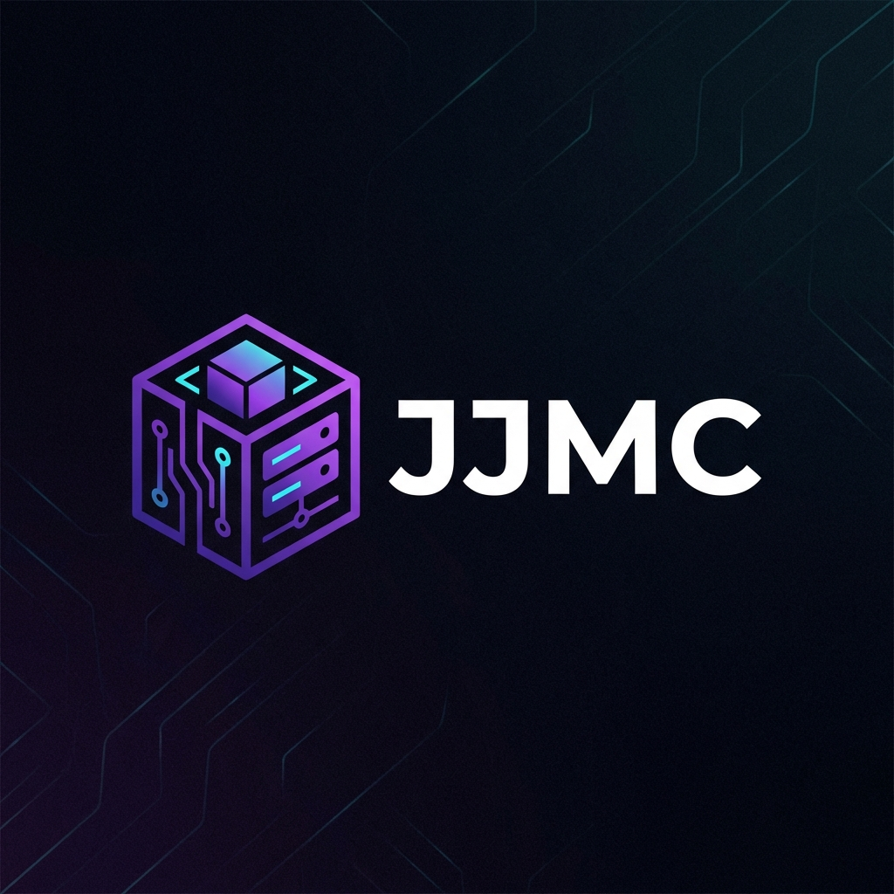

<div align="center">
  
  <h1>JJMC</h1>
  <p><b>A modern, powerful, and stupidly simple Minecraft Server Manager.</b></p>
</div>

---

JJMC isn't just another server wrapper. It's built to make running one server (or fifty) actually enjoyable. Whether you're hosting a private SMP for friends or managing a complex modded network, we've got you covered.

## ✨ Features

### 🚀 **Instance Management**
Stop fighting with JAR files and command lines.
- **Support for Everything**: Native support for **Vanilla**, **Fabric**, **Forge**, **NeoForge**, **Quilt**, and **Paper**. 
- **Spigot BuildTools**: We handle the annoying BuildTools compilation for you automatically.
- **Version Fetching**: Always see the latest valid game and loader versions.
- **Import/Export**: Drag and drop existing server folders to import them in seconds.
- **Folders & Organization**: Group your instances into folders (like "SMPs", "Test Servers") so your dashboard stays clean.

### 🛠️ **Modding Made Easy**
- **Modrinth & Spiget Integration**: Search, install, and update Mods and Plugins directly from the dashboard.
- **Modpacks**: One-click install for popular modpacks.
- **Packwiz Support**: Building your own pack? We support Packwiz natively for easy updates and distribution.
- **Version Awareness**: We only show you mods that actually match your Minecraft version.

### 🌐 **Networking & Access**
- **Ngrok Tunneling**: Don't want to port forward? Generate a free tunnel URL instantly so friends can join without messing with your router.
- **Port Forwarding Helper**: Tools to help you manage standard port forwarding if you prefer the classic route.
- **RCON Support**: Enable and configure RCON for remote console access.

### 🎮 **Advanced Control**
- **Java Manager**: Download and swap between Java 8, 11, 17, and 21 on the fly. No more "Java version mismatch" errors.
- **Live Console**: A beautiful, color-coded terminal that supports command history and clickable links.
- **Crash Detection**: If your server dies, we'll catch it and can auto-restart it for you.
- **Docker Support**: Run everything in a container for maximum isolation.

### 📂 **Full File System Access**
- **Web File Manager**: Browse, delete, and rename files without FTP.
- **Editor**: Edit `server.properties`, configs, and JSON files right in the browser with syntax highlighting.
- **Archives**: Zip up worlds to share or unzip downloaded maps instantly.
- **Drag & Drop Upload**: Just drag files into the browser to upload them.

### 🤖 **Automation & Monitoring**
- **Task Scheduler**: Set up recurring tasks like generic restarts, "Say Hello" messages, or backups using Cron syntax.
- **Discord Webhooks**: Get rich notifications in your Discord server when your server starts, stops, or crashes (with status colors!).
- **Resource Monitoring**: Watch CPU and RAM usage in real-time to spot lag before it happens.
- **Backups**: One-click backups and restores. Never lose your world again.

## 🏁 Getting Started

### Linux / macOS
```bash
./run.sh
```

### Windows
Double click `run.bat` or `run.ps1`.

That's it. The script handles downloading the portable Go and Node.js runtimes so you don't even need to install them globally.

## 🐳 Docker
Prefer containers? Check [TUTORIAL.md](TUTORIAL.md) for our Docker Compose setup.

## License
MIT
